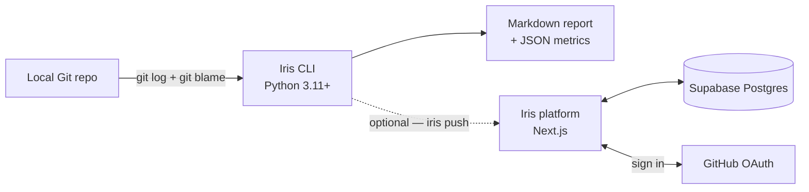

# Iris

**Engineering intelligence for the AI era.**

Iris analyzes Git repositories and generates impact reports that measure the ratio between **durable delivery** (signal) and **corrective effort** (noise) in software engineering — with specific focus on how AI tools change that ratio.

---

## What It Does

Iris reads repository history, classifies commits by intent and origin, analyzes PR lifecycle, and produces a comprehensive report answering:

- Is AI-assisted code more durable or more disposable?
- Which areas of the codebase are stable vs constantly churning?
- What caused destabilization — and when did it start?
- Are code reviews catching issues or rubber-stamping?
- Where is AI being used but not attributed?

### Validated on Real Data

Tested on an organization with 58 repositories, 3,497 commits, and 1,211 PRs:

- AI-assisted code stabilizes at **79%** vs **64%** for human code
- **45%** of "human" commits match high-velocity patterns (unattributed AI)
- Automated coupling detection found 4 messaging client implementations that always change together
- Weekly timeline with pattern detection explained destabilization causes

---

## Quick Start

### One-line install

The install scripts are served by your Iris deployment (the value of `NEXT_PUBLIC_APP_URL`). Replace `<your-iris-deployment>` with that URL:

```bash
# macOS / Linux / WSL
curl -fsSL <your-iris-deployment>/install.sh | sh

# Windows PowerShell
irm <your-iris-deployment>/install.ps1 | iex
```

The installer:

1. Checks for Python 3.11+ and Git
2. Creates a dedicated venv at `~/.iris/venv` (no system conflicts)
3. Installs Iris and creates a `iris` wrapper at `~/.local/bin/iris`
4. Adds `~/.local/bin` to your PATH (zshrc/bashrc or Windows user PATH)
5. Uses `pipx` if available (preferred for isolation)

**Environment variables:**

| Variable | Default | Description |
|---|---|---|
| `IRIS_HOME` | `~/.iris` | Installation directory |
| `IRIS_VERSION` | `latest` | Specific version to install (e.g. `1.1.2`) |
| `IRIS_INSTALL_METHOD` | `auto` | Force `pip` or `pipx` |

**Uninstall:**

```bash
iris uninstall                      # recommended (cleans PATH entries too)
rm -rf ~/.iris ~/.local/bin/iris  # manual — macOS / Linux / WSL
```

### Manual install (development)

```bash
git clone git@github.com:RocketBus/clickbus-iris.git iris
cd iris
python3 -m venv .venv
source .venv/bin/activate
pip install -e .
```

Requirements: **Python 3.11+**, **Git**. Optional: **GitHub CLI (`gh`)** for PR analysis. Zero external dependencies.

### Single Repository

```bash
iris /path/to/repo
iris /path/to/repo --trend              # with 30d vs 90d trend analysis
iris /path/to/repo --lang pt-br         # Portuguese report
```

### Organization (all repos)

```bash
iris --org /path/to/org-directory
iris --org /path/to/org-directory --trend --repos repo1,repo2
```

### AI Attribution Hook

```bash
iris hook install /path/to/repo         # install prepare-commit-msg hook
iris hook status /path/to/repo          # check installation
iris hook uninstall /path/to/repo       # remove hook
```

The hook detects `$CLAUDE_CODE`, `$AI_AGENT`, `$CURSOR_SESSION`, `$WINDSURF_SESSION` and adds a `Co-Authored-By` tag before the commit is created. No history rewriting.

### PR Analysis

```bash
iris pr                    # analyze PR for current branch (auto-detect)
iris pr 42                 # analyze specific PR
iris pr 42 --comment       # post insights as a PR comment
iris pr --no-context       # skip repo history (faster, fewer insights)
```

Generates concise markdown insights for code review:
- **Composition** — how many commits are AI-assisted, which tools
- **Churn context** — files in this PR that are actively churning
- **Cascade risk** — files recently part of correction cascades
- **Size & concentration** — large PR warnings, directory focus

Requires `gh` CLI installed and authenticated.

### Options

| Flag | Default | Description |
|---|---|---|
| `--days` | 90 | Analysis window in days |
| `--churn-days` | 14 | Churn detection window in days |
| `--out` | `out/` | Output directory |
| `--lang` | `en` | Report language (`en`, `pt-br`) |
| `--trend` | off | Enable trend analysis (recent vs baseline) |
| `--recent-days` | 30 | Recent window for trend analysis |
| `--repos` | all | Comma-separated repo filter (org mode only) |

### Output

```
out/90d/
  org-repo-report.md       # Full Markdown report
  org-repo-metrics.json    # Machine-readable metrics
  org-name-org-report.md   # Organization report (org mode)
  org-name-org-metrics.json
```

---

## Report Sections

A single repo report includes (all sections are conditional — only appear when data is sufficient):

| Section | What It Shows |
|---|---|
| **Key Findings** | 3-5 executive bullet points with systemic context |
| **Metrics Summary** | Commits, reverts, churn, stabilization |
| **Engineering Behavior** | Intent distribution: feature, fix, refactor, config |
| **Stability by Change Type** | Stabilization per intent |
| **AI Impact** | Stabilization, churn by origin (Human vs AI-Assisted) |
| **Commit Shape** | Structural profile by origin (focused, spread, bulk, surgical) |
| **Code Durability — Time to Rework** | Median rework latency by origin |
| **Code Durability — Line Survival** | % of introduced lines still at HEAD, via git blame |
| **Correction Cascades** | Fix-following patterns by origin |
| **Attribution Gap** | Unattributed high-velocity commits |
| **Churn Investigation** | Top churning files with chains (feat->fix->fix) + file coupling |
| **Stability Map** | Per-directory stabilization and churn |
| **Knowledge Priming** | Detected AI context files (CLAUDE.md, .cursor/rules, etc.) |
| **Code Review Acceptance Rate** | PR survival by origin and AI tool |
| **Origin Funnel** | Committed -> In PR -> Stabilized -> Lines Surviving |
| **PR Lifecycle** | Merge time, review rounds, single-pass rate |
| **Delivery Velocity** | Commits/week trend + velocity-durability correlation |
| **Activity Timeline** | Weekly heatmap + commit/LOC/intent/origin breakdown |
| **Trend Analysis** | 30d vs 90d delta with attention signals |

### Delivery Pulse

The Activity Timeline includes a visual heatmap:

```
🟩       ⬜       🟩       🟨       🟩       🟨       🟩       🟨🟨🟨🟨 🟩       🟨       🟥🟥
01/12    01/19    01/26    02/02    02/09    02/16    02/23    03/02    03/09    03/16    03/23

🟩 Stable (>=70%)  🟨 Moderate (50-70%)  🟥 Volatile (<50%)  ⬜ Insufficient data
```

---

## Architecture



The CLI is the engine: read-only on the working copy, deterministic Markdown + JSON output, runs entirely offline. The platform is optional — it ingests the same metrics over a token-authenticated `/api/ingest` endpoint and surfaces cross-repo views and trends. The two ship and version independently.

### File tree

```
iris/
  cli.py                              # CLI entry point + hook subcommands
  org_runner.py                        # Organization-level orchestration
  i18n.py                              # Internationalization (EN, PT-BR)
  ingestion/
    git_reader.py                      # Commit ingestion via git log
    github_reader.py                   # PR ingestion via gh CLI
  analysis/
    origin_classifier.py               # Human / AI-Assisted / Bot + tool detection
    intent_classifier.py               # Feature / Fix / Refactor / Config
    churn_calculator.py                # File-level churn detection
    revert_detector.py                 # Revert identification by message pattern
    commit_shape.py                    # Structural profile (focused/spread/bulk/surgical)
    fix_latency.py                     # Time-to-rework by origin
    durability.py                      # Line survival via git blame
    cascade_detector.py                # Correction cascade detection
    acceptance_rate.py                 # Code review survival by origin/tool
    origin_funnel.py                   # Commit -> PR -> Stabilize -> Survive funnel
    activity_timeline.py               # Weekly timeline + pattern detection
    adoption_detector.py               # AI adoption inflection point
    velocity.py                        # Delivery speed + durability correlation
    trend_delta.py                     # Temporal comparison + attention signals
    org_intelligence.py                # Cross-repo signals + delivery narrative
    stability_map.py                   # Per-directory stability aggregation
    churn_detail.py                    # Churn chains + file coupling
    attribution_gap.py                 # Unattributed high-velocity detection
    priming_detector.py                # AI context file detection
  metrics/
    stabilization.py                   # Core stabilization ratio
    aggregator.py                      # Orchestrates all analysis modules
  models/
    commit.py, pull_request.py         # Data models
    metrics.py                         # ReportMetrics schema
    intent.py, trend.py, org.py        # Domain models
    adoption.py, velocity.py           # Feature models
    fix_latency.py, commit_shape.py    # Feature models
    context.py                         # Execution parameters
  reports/
    writer.py                          # report.md + metrics.json generation
    narrative.py                       # Key findings + explanations
    org_writer.py                      # Organization report
  hooks/
    manager.py                         # Hook install/uninstall/status
    prepare_commit_msg.sh              # AI attribution hook script
docs/
  VISION.md                            # Product vision
  PRINCIPLES.md                        # Guiding principles
  DECISIONS.md                         # Architectural decisions
  METHODOLOGY.md                       # Signal/noise philosophy
  METRICS.md                           # Canonical metric-field dictionary
  KNOWLEDGE-PRIMING-RESEARCH.md        # Knowledge Priming research
```

---

## Principles

1. **Measure systems, never individuals** — Iris analyzes repositories and teams, not developers.
2. **Metrics are hypotheses** — All values are experimental and evolve with observation.
3. **Explain why, not just what** — Churn chains, coupling, and timelines explain causes.
4. **Attribution without accusation** — Flag patterns, never claim certainty about AI usage.
5. **Simplicity first** — Scripts over frameworks, zero external dependencies, deterministic output.

---

## Status

**Stage 0: Signal Discovery — Complete.**

15 analysis modules validated on real organizational data. Entering Stage 1: Attribution & Adoption.

---

## Privacy

The CLI runs entirely on your machine. No telemetry is sent unless you explicitly opt in by setting `OTEL_EXPORTER_OTLP_ENDPOINT` and pointing it at your own OpenTelemetry collector. See [`docs/TELEMETRY.md`](docs/TELEMETRY.md) for what is and isn't collected, and how to enable / disable.

The hosted platform deploys are internal-access. Authentication is via GitHub OAuth; no source code is uploaded — only the metrics produced by the CLI.

## License

Licensed under the [Apache License, Version 2.0](LICENSE). See [NOTICE](NOTICE) for attribution.
